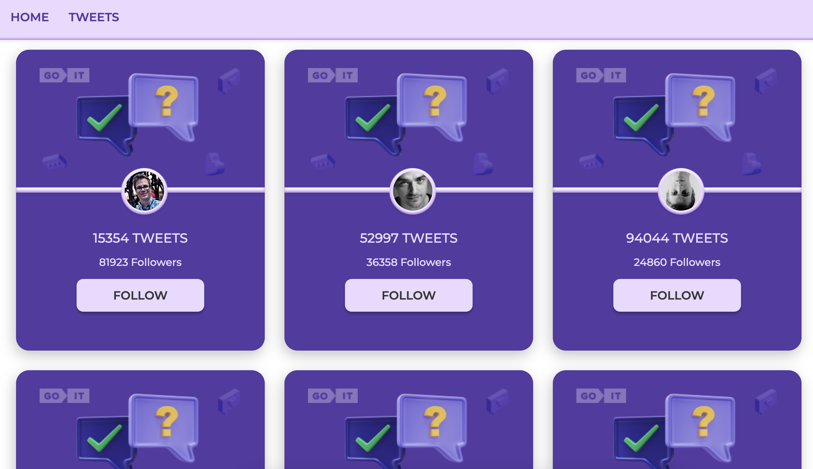
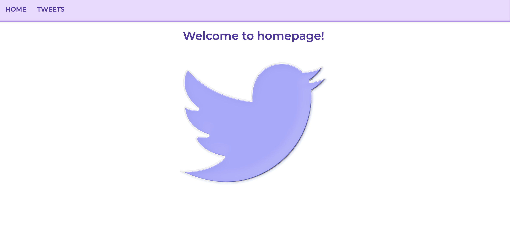
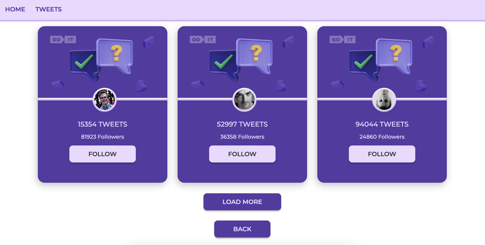

# Cards Tweets

This project was bootstrapped with [Create React App](https://github.com/facebook/create-react-app).

## Description

Cards Tweets implemented on react.js with using redux. This web application consists of two pages Home and Tweets.
The Home page displays greeting for visitors.

The Tweets page displays cards another visitors with brief information such as photo user, numbers of followers and tweets.

You can follow or unfollow a person.

## Project SetUp

npm install
npm run serve
